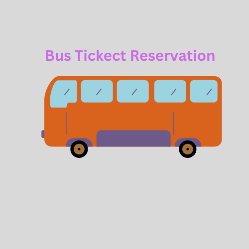

# brief-haircut-1894

<h2>
   Bus Ticket Reservation System
</h2>   
 

A bus ticket reservation system is an java application designed to provide customers with a personalized easy-to-utilize user experience for booking and purchasing tickets online. It stores customers' personal data records, scheduled routes, frequent trips, drop points, and other information.

Bus ticket reservation system is a console based application.

Build Bus ticket reservation system application during the construct week at [Masai School](https://masaischool.com/). Completed the project within six days.

# Features

- Administrator can login his username and password
- Administrator can provide details like Bus Name, Bus Route, Bus Type –AC/non-AC, seats, departure time and arrival time
- Administrator can provide the confirmation of the seat to the Customer
- Customer can register by giving all the details
- Customer can login his username and password
- Customer can book ticket by selecting Source and destination
- Customer can cancel ticket

# Technology used

- Java
- MySQL
- Git & GitHub

# Overview

## **ER Diagram**

_Customer and Bus has many to many relationship_
 
_Booking table as linking between Customer and Bus_
 

## Flowchart

